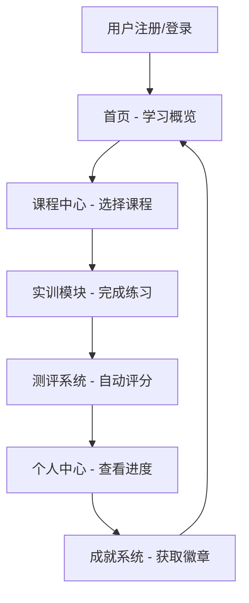

## 1. 产品概述
商务数据分析实训任务平台是一款专为高职商务数据分析与应用专业学生设计的沉浸式学习平台，提供完整的课程体系和互动式学习体验。
- 该平台旨在帮助学生巩固Python基础、数据采集与处理、商务数据分析等课程知识，提升实战能力。
- 目标用户为高职大二第二学期学生，已具备一定的Python基础和数据分析知识。

## 2. 核心功能

### 2.1 用户角色
| 角色 | 注册方式 | 核心权限 |
|------|---------|----------|
| 学生 | 邮箱注册 | 浏览课程、完成实训、查看学习进度、获取成就 |
| 教师 | 管理员邀请 | 管理课程、发布实训任务、查看学生进度、评估成绩 |

### 2.2 功能模块
1. **首页**：学习概览、最近实训、推荐课程、成就展示
2. **课程中心**：完整课程体系、学习路径、课程详情
3. **实训模块**：互动式学习、练习、测评
4. **个人中心**：学习进度、成就系统、个人资料

### 2.3 页面详情
| 页面名称 | 模块名称 | 功能描述 |
|---------|---------|----------|
| 首页 | 学习概览 | 显示总学习时长、完成课程数、当前学习进度 |
| 首页 | 最近实训 | 展示最近参与的实训任务和完成状态 |
| 首页 | 推荐课程 | 根据学习路径推荐适合的课程 |
| 首页 | 成就展示 | 展示获得的成就徽章和排名 |
| 课程中心 | 课程体系 | 按模块分类展示完整课程列表 |
| 课程中心 | 学习路径 | 可视化学习路径，显示已完成和待完成课程 |
| 课程中心 | 课程详情 | 课程内容、学习资源、实训任务 |
| 实训模块 | 互动学习 | 交互式代码编辑器、实时运行结果 |
| 实训模块 | 练习任务 | 基于真实商务场景的数据分析练习 |
| 实训模块 | 测评系统 | 自动评分、反馈和解析 |
| 个人中心 | 学习进度 | 详细的学习统计、进度图表 |
| 个人中心 | 成就系统 | 成就徽章、积分、排名 |
| 个人中心 | 个人资料 | 基本信息、学习偏好设置 |

## 3. 核心流程
用户注册登录后，首先进入首页查看学习概览，然后通过课程中心选择适合的课程，进入实训模块完成练习和测评，最后在个人中心查看学习进度和成就。

## 4. 用户界面设计
### 4.1 设计风格
- 主色调：深蓝色 (#1a365d) 和湖蓝色 (#4299e1)
- 辅助色：橙色 (#ed8936) 用于强调和交互元素
- 按钮样式：圆角矩形，带有轻微的阴影效果
- 字体：无衬线字体，主标题 20px，副标题 16px，正文 14px
- 布局风格：卡片式布局，清晰的视觉层次，充足的留白
- 图标风格：简约线性图标，配合主题色彩

### 4.2 页面设计概览
| 页面名称 | 模块名称 | UI元素 |
|---------|---------|--------|
| 首页 | 学习概览 | 仪表盘样式，使用卡片和图表展示关键数据，主色调背景 |
| 首页 | 最近实训 | 列表形式，显示实训名称、完成状态和进度条 |
| 首页 | 推荐课程 | 卡片式布局，包含课程名称、简介和难度标识 |
| 首页 | 成就展示 | 徽章墙形式，获得的徽章高亮显示 |
| 课程中心 | 课程体系 | 分类标签页，课程卡片包含进度指示器 |
| 课程中心 | 学习路径 | 可视化流程图，节点表示课程，连线表示学习顺序 |
| 课程中心 | 课程详情 | 侧边导航，主内容区显示课程内容和资源 |
| 实训模块 | 互动学习 | 分屏设计，左侧代码编辑器，右侧运行结果 |
| 实训模块 | 练习任务 | 任务描述区域，提交按钮，实时反馈 |
| 实训模块 | 测评系统 | 分数展示，错题解析，改进建议 |
| 个人中心 | 学习进度 | 折线图展示学习趋势，饼图展示课程完成情况 |
| 个人中心 | 成就系统 | 徽章展示区，积分排行榜 |
| 个人中心 | 个人资料 | 表单式布局，头像上传，信息编辑 |

### 4.3 响应式设计
- 采用桌面优先设计，同时支持平板和移动设备
- 在小屏幕设备上，布局会自动调整为单列，保持核心功能的可访问性
- 触控优化，确保在移动设备上的良好操作体验

### 4.4 3D场景引导（不适用）
- 本项目不包含3D场景