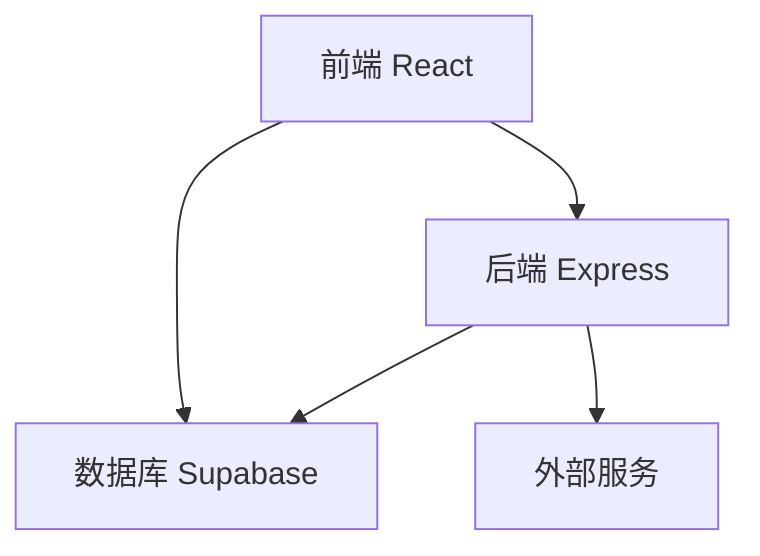
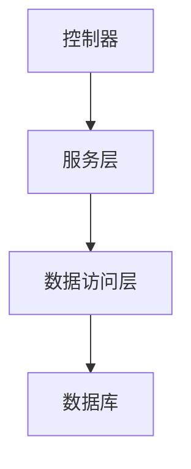
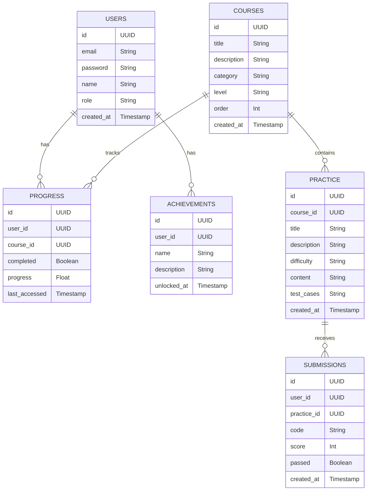

## 1. 架构设计


## 2. 技术描述
- 前端：React@18 + TypeScript + Tailwind CSS + Vite
- 初始化工具：vite-init
- 后端：Express@4 + TypeScript
- 数据库：Supabase (PostgreSQL)
- 状态管理：Zustand
- 路由：React Router
- 图表库：Recharts
- 代码编辑器：Monaco Editor

## 3. 路由定义
| 路由 | 用途 |
|------|------|
| / | 首页 - 学习概览 |
| /courses | 课程中心 |
| /courses/:id | 课程详情 |
| /practice | 实训模块 |
| /practice/:id | 实训详情 |
| /profile | 个人中心 |
| /login | 登录页面 |
| /register | 注册页面 |

## 4. API 定义
### 4.1 用户相关
- **POST /api/auth/register** - 用户注册
- **POST /api/auth/login** - 用户登录
- **GET /api/auth/user** - 获取用户信息

### 4.2 课程相关
- **GET /api/courses** - 获取课程列表
- **GET /api/courses/:id** - 获取课程详情
- **GET /api/courses/:id/practice** - 获取课程相关实训

### 4.3 实训相关
- **GET /api/practice** - 获取实训列表
- **GET /api/practice/:id** - 获取实训详情
- **POST /api/practice/:id/submit** - 提交实训答案
- **GET /api/practice/:id/result** - 获取实训结果

### 4.4 学习进度相关
- **GET /api/progress** - 获取学习进度
- **POST /api/progress** - 更新学习进度

### 4.5 成就相关
- **GET /api/achievements** - 获取成就列表
- **POST /api/achievements** - 解锁成就

## 5. 服务器架构图


## 6. 数据模型
### 6.1 数据模型定义


### 6.2 数据定义语言
```sql
-- 创建用户表
CREATE TABLE users (
    id UUID PRIMARY KEY DEFAULT gen_random_uuid(),
    email VARCHAR(255) UNIQUE NOT NULL,
    password VARCHAR(255) NOT NULL,
    name VARCHAR(255) NOT NULL,
    role VARCHAR(50) DEFAULT 'student',
    created_at TIMESTAMP DEFAULT NOW()
);

-- 创建课程表
CREATE TABLE courses (
    id UUID PRIMARY KEY DEFAULT gen_random_uuid(),
    title VARCHAR(255) NOT NULL,
    description TEXT,
    category VARCHAR(100),
    level VARCHAR(50),
    "order" INTEGER,
    created_at TIMESTAMP DEFAULT NOW()
);

-- 创建实训表
CREATE TABLE practice (
    id UUID PRIMARY KEY DEFAULT gen_random_uuid(),
    course_id UUID REFERENCES courses(id),
    title VARCHAR(255) NOT NULL,
    description TEXT,
    difficulty VARCHAR(50),
    content TEXT,
    test_cases JSONB,
    created_at TIMESTAMP DEFAULT NOW()
);

-- 创建提交表
CREATE TABLE submissions (
    id UUID PRIMARY KEY DEFAULT gen_random_uuid(),
    user_id UUID REFERENCES users(id),
    practice_id UUID REFERENCES practice(id),
    code TEXT,
    score INTEGER,
    passed BOOLEAN,
    created_at TIMESTAMP DEFAULT NOW()
);

-- 创建进度表
CREATE TABLE progress (
    id UUID PRIMARY KEY DEFAULT gen_random_uuid(),
    user_id UUID REFERENCES users(id),
    course_id UUID REFERENCES courses(id),
    completed BOOLEAN DEFAULT FALSE,
    progress FLOAT DEFAULT 0,
    last_accessed TIMESTAMP DEFAULT NOW(),
    UNIQUE(user_id, course_id)
);

-- 创建成就表
CREATE TABLE achievements (
    id UUID PRIMARY KEY DEFAULT gen_random_uuid(),
    user_id UUID REFERENCES users(id),
    name VARCHAR(255) NOT NULL,
    description TEXT,
    unlocked_at TIMESTAMP DEFAULT NOW()
);

-- 为anon角色授予基本读取权限
GRANT SELECT ON users, courses, practice, progress, achievements TO anon;

-- 为authenticated角色授予所有权限
GRANT ALL PRIVILEGES ON users, courses, practice, submissions, progress, achievements TO authenticated;

-- 插入初始数据
INSERT INTO courses (title, description, category, level, "order") VALUES
('Python基础回顾', '复习Python核心语法和数据结构', '基础', '初级', 1),
('数据采集与处理', '学习网页爬取和数据清洗技术', '数据处理', '中级', 2),
('商务数据分析基础', '掌握商务场景下的数据分析方法', '商务分析', '中级', 3),
('数据可视化', '学习使用Python库进行数据可视化', '数据展示', '中级', 4),
('商业智能分析', '应用数据分析解决实际商业问题', '高级应用', '高级', 5);

-- 为每个课程创建实训任务
INSERT INTO practice (course_id, title, description, difficulty, content, test_cases) VALUES
((SELECT id FROM courses WHERE title = 'Python基础回顾'), 'Python语法练习', '完成基本的Python语法和函数练习', '简单', '编写一个函数，计算列表中所有元素的平均值', '{"test_cases": [{"input": "[1, 2, 3, 4, 5]", "expected": 3}, {"input": "[10, 20, 30]", "expected": 20}]}'),
((SELECT id FROM courses WHERE title = '数据采集与处理'), '网页爬取练习', '使用requests和beautifulsoup爬取网页数据', '中等', '爬取一个电商网站的商品信息并存储为CSV文件', '{"test_cases": [{"input": "https://example.com/products", "expected": "成功爬取至少10个商品"}]}'),
((SELECT id FROM courses WHERE title = '商务数据分析基础'), '销售数据分析', '分析销售数据并生成报告', '中等', '分析销售数据，计算月度销售额和增长率', '{"test_cases": [{"input": "sales_data.csv", "expected": "正确计算月度销售额和增长率"}]}'),
((SELECT id FROM courses WHERE title = '数据可视化'), '销售数据可视化', '使用matplotlib或seaborn创建销售数据图表', '中等', '创建销售趋势图和地区分布图', '{"test_cases": [{"input": "sales_data.csv", "expected": "生成至少2个不同类型的图表"}]}'),
((SELECT id FROM courses WHERE title = '商业智能分析'), '市场分析报告', '综合分析市场数据并提供商业建议', '困难', '分析市场数据，识别趋势并提供商业建议', '{"test_cases": [{"input": "market_data.csv", "expected": "提供至少3条有价值的商业建议"}]}');
```